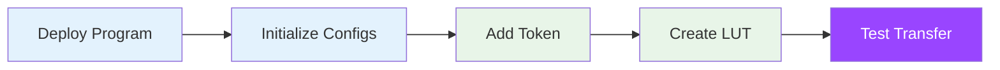
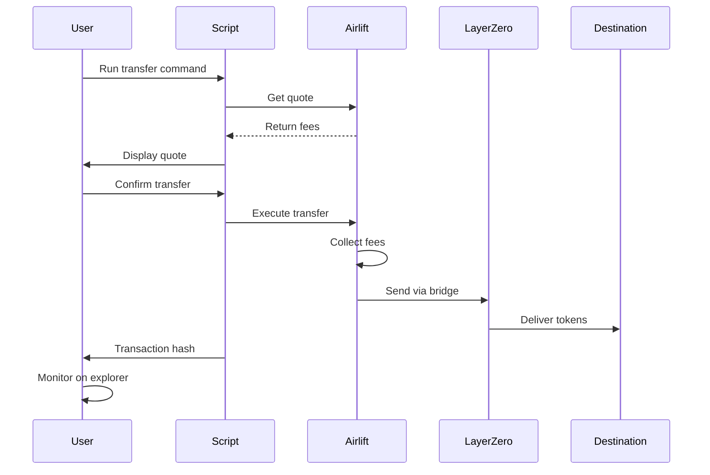

# Quick Start Guide

Get Sol-Airlift up and running in minutes. This guide walks you through deploying the program, initial setup, and your first cross-chain transfer.

## Overview



## Step 1: Deploy to Devnet

### Clone and Build

```bash
# Clone the repository
git clone https://github.com/glacislabs/sol-airlift.git
cd sol-airlift

# Install dependencies
pnpm install

# Build the program
anchor build

# Generate IDL and clients
yarn generate-idl
yarn generate-clients
```

### Deploy Program

```bash
# For FIRST TIME deployment to devnet
anchor deploy --provider.cluster devnet

# Note the program ID from the output
Program Id: AiRLxBjVX2AVqPmDfEEuKhCgRrmz5axW5FY5hseWH3zp
```

> **Note**: This creates a new program deployment. For updating an existing program, see [Updating the Contract](#updating-the-contract) below.

### Update Configuration

Update `Anchor.toml` with your program ID:

```toml
[programs.devnet]
airlift = "AiRLxBjVX2AVqPmDfEEuKhCgRrmz5axW5FY5hseWH3zp"

[provider]
cluster = "devnet"
wallet = "~/.config/solana/id.json"
```

### Updating the Contract

When you need to update an already deployed program:

**For Devnet:**
```bash
# Make your code changes, then:
anchor build
anchor upgrade target/deploy/airlift.so --program-id AiRLxBjVX2AVqPmDfEEuKhCgRrmz5axW5FY5hseWH3zp --provider.cluster devnet
```

**For Mainnet:**
```bash
# Check current program size first
solana program show 6as1nMXzpNhRG1jaJa3s7SXw3J6eQwG29qLfSwDj8vgx -u m

# Use the redeploy script with the current size
./scripts/redeploy-mainnet.sh 456384
```

> **Important**: The redeploy script handles program extension if your new build is larger than the current deployment.

## Step 2: Initial Setup

### Run Setup Script

```bash
# Navigate to scripts directory
cd scripts

# Run the comprehensive setup script
ts-node set-up-airlift.ts
```

This script will:
1. Initialize global configuration
2. Set up LayerZero configuration
3. Set up Wormhole NTT configuration
4. Create initial token fee configurations

### Setup Script Breakdown

```typescript
// What the setup script does:

// 1. Initialize Global Config
await program.methods
  .initializeGlobalConfig({
    admin: wallet.publicKey,
    feeRecipient: feeRecipient.publicKey,
  })
  .rpc();

// 2. Initialize LayerZero Config
await program.methods
  .initializeLayerZeroConfig()
  .rpc();

// 3. Initialize NTT Config  
await program.methods
  .initializeNttConfig()
  .rpc();

// 4. Set up chain mappings
const chainMappings = [
  { lzChainId: 101, standardChainId: 1 },   // Ethereum
  { lzChainId: 110, standardChainId: 42161 }, // Arbitrum
  // ... more chains
];
```

## Step 3: Add Your First Token

### Option A: Add NTT Token (USDC)

```bash
# Add USDC as NTT token
ts-node add-token-config.ts \
  --config ../config/tokens/USDC-NTT.json \
  --type ntt

# Create Address Lookup Table
ts-node create-lut.ts --token USDC --type ntt
```

### Option B: Add OFT Token

```bash
# Add token with OFT support
ts-node add-token-config.ts \
  --config ../config/tokens/WETH-OFT.json \
  --type oft

# Create LUT for specific destination
ts-node create-custom-lut.ts \
  --token WETH \
  --type oft \
  --destination ethereum
```

## Step 4: Send Your First Transfer

### Get a Quote

```typescript
// scripts/test-transfer.ts
import { AirliftClient } from 'airlift-solana-sdk';
import * as anchor from "@coral-xyz/anchor";
import { EndpointId } from "@layerzerolabs/lz-definitions";

// Initialize client
const client = new AirliftClient(connection, userKeypair, adminKeypair, "Mainnet");

// Token configuration
const mint = new PublicKey(tokenConfig.solana.token);
const oftProgramId = new PublicKey(tokenConfig.solana.oftProgramId);
const oftTokenEscrow = tokenConfig.solana.tokenEscrow;

// Get fee configuration
const feeConfig = await client.getFeeConfigForToken(mint);

// Get LayerZero quote
const quote = await client.quoteLZ(
  EndpointId.SOLANA_V2_MAINNET,         // Source endpoint
  userKeypair,                           // Payer
  "0x742d35Cc6634C0532925a3b844Bc9e7595f7E3d2", // Recipient
  oftProgramId,                          // OFT program
  oftTokenEscrow,                        // Token escrow
  mint,                                  // Token mint
  30101,                                 // Ethereum endpoint ID
  new anchor.BN(100_000_000),           // 100 USDC
  feeConfig,                            // Fee config
  tokenConfig.gmpParameters             // GMP parameters
);

console.log('Quote:', {
  bridgeFee: quote.feeCosts.bridgeFee.nativeFee.toString(),
  airliftFee: quote.feeCosts.airliftFee.nativeFee.toString(),
  tokenFee: quote.feeCosts.airliftFee.tokenFee.toString(),
});
```

### Execute Transfer

```bash
# Run test transfer script
ts-node scripts/send-devnet-lz.ts \
  --token USDC \
  --amount 10 \
  --destination ethereum \
  --recipient 0x742d35Cc6634C0532925a3b844Bc9e7595f7E3d2
```

### Transaction Flow Visualization



## Step 5: Verify Your Setup

### Check Configurations

```bash
# Verify global config
ts-node scripts/check-config.ts --type global

# Verify token config
ts-node scripts/check-config.ts --type token --token USDC

# Verify LUT
ts-node scripts/verify-lut.ts --token USDC
```

### Expected Output

```
✅ Global Config:
   - Admin: 7xKXtPsv2v6mJZpUcVFiZYPgFLrPZhHJuUsfpByCQPrv
   - Fee Recipient: 9WzDXwBbmkg8ZTbNMqUxvQRAyrZzDsGYdLVL9zYtAZWPk

✅ Token Config (USDC):
   - Type: NTT V2
   - Mint: EPjFWdd5AufqSSqeM2qN1xzybapC8G4wEGGkZwyTDt1v
   - Manager: NTtDqe4fqCCPGA3KPPKqPeU2JbCeAjPkKECBx23YmvK

✅ LUT Verified:
   - Address: 7UijeNxd6rkWKMgNKJDXrE2JjfeUjuXJDR7fqnTqxWmk
   - Accounts: 25
   - Required accounts present
```

## Common Setup Issues

### Issue: "Insufficient SOL for deployment"

**Solution**: Get devnet SOL:
```bash
# Airdrop SOL (max 2 at a time)
solana airdrop 2

# Check balance
solana balance
```

### Issue: "Program deployment failed"

**Solution**: Check your Anchor version:
```bash
anchor --version
# Should be 0.30.1

# If not, switch versions
avm use 0.30.1
```

### Issue: "Token config already exists"

**Solution**: Token might already be registered:
```bash
# Check existing tokens
ts-node scripts/list-tokens.ts

# If exists, skip to creating LUT
ts-node create-lut.ts --token YOUR_TOKEN
```

## Next Steps

Congratulations! You've successfully:
- ✅ Deployed Sol-Airlift to devnet
- ✅ Initialized all configurations
- ✅ Added your first token
- ✅ Created Address Lookup Tables
- ✅ Sent a test transfer

### What's Next?

1. **Add More Tokens**
   - [NTT Token Setup](../token-management/ntt-setup)
   - [LayerZero OFT Setup](../token-management/layerzero-setup)

2. **Configure Fees**
   - [Fee Configuration Guide](../token-management/fee-configuration)

3. **Production Deployment**
   - [Environment Setup](./environment-setup)
   - [Security Checklist](../troubleshooting/common-issues)
   
   **First-Time Mainnet Deployment:**
   ```bash
   # Build and deploy for the first time
   anchor build
   anchor deploy --provider.cluster mainnet
   ```
   
   **Updating Existing Mainnet Contract:**
   ```bash
   # Check current program size
   solana program show 6as1nMXzpNhRG1jaJa3s7SXw3J6eQwG29qLfSwDj8vgx -u m
   
   # Update/upgrade using the redeploy script (example size: 456384)
   ./scripts/redeploy-mainnet.sh 456384
   ```

4. **Integration**
   - [SDK Documentation](../sdk/overview)
   - [Frontend Integration](../examples/integration)

## Quick Reference

### Useful Commands

```bash
# Check program deployment
anchor idl fetch AiRLxBjVX2AVqPmDfEEuKhCgRrmz5axW5FY5hseWH3zp

# List all tokens
ts-node scripts/list-tokens.ts

# Get fee info
ts-node scripts/get-fee-info.ts --token USDC

# Test quote generation
ts-node scripts/test-quote.ts --token USDC --amount 100 --dst ethereum
```

### Key Addresses (Devnet)

```typescript
// Program IDs
const AIRLIFT_PROGRAM = "AiRLxBjVX2AVqPmDfEEuKhCgRrmz5axW5FY5hseWH3zp";
const LZ_ENDPOINT = "76y77prsiCMvXMjuoZ5VRrhG5qYBrUMYTE5WgHqgjEn6";

// Common Token Mints (Devnet)
const USDC = "Gh9ZwEmdLJ8DscKNTkTqPbNwLNNBjuSzaG9Vn2XBiBTb";
const WETH = "7vfCXTUXx5WJV5JADk17DUJ4ksgau7utNKj4b963voxs";
```

## Support

Need help? 
- Check [Troubleshooting Guide](../troubleshooting/common-issues)
- Review [Complete Examples](../examples/scripts)
- Join our [Discord Community](#) 