# Creating Address Lookup Tables

Address Lookup Tables (LUTs) are essential for Sol-Airlift transfers as they optimize transaction size by replacing full addresses with compact indices.

## Why LUTs are Required

Cross-chain transfers involve many accounts:
- Token accounts
- Bridge program accounts
- Fee configuration accounts
- Authority accounts
- Associated token accounts

Without LUTs, transactions often exceed Solana's 1232-byte limit.

```mermaid
flowchart LR
    A[32 Accounts] --> B[Without LUT: 1400 bytes]
    A --> C[With LUT: 850 bytes]
    
    B --> D[❌ Transaction Too Large]
    C --> E[✅ Transaction Fits]
    
    style D fill:#ffcccc
    style E fill:#ccffcc
```



## Creating Token-Specific LUTs

### Basic LUT Creation

```bash
# Create LUT for a token
ts-node scripts/create-lut.ts --token USDC --type ntt

# Output:
# 📋 Collecting accounts for USDC (NTT)...
# ✅ Found 18 accounts
# 📝 Creating Address Lookup Table...
# ✅ LUT created: 7UijeNxd6rkWKMgNKJDXrE2JjfeUjuXJDR7fqnTqxWmk
# 📊 Transaction: 3xK9n...
```

### Destination-Specific LUTs

For OFT tokens, create LUTs per destination:

```bash
# Create LUT for specific destination
ts-node scripts/create-custom-lut.ts \
  --token WSOL \
  --type oft \
  --destination ethereum

# Create for all destinations
for dest in ethereum arbitrum optimism polygon; do
  ts-node scripts/create-custom-lut.ts \
    --token WSOL \
    --type oft \
    --destination $dest
done
```

## LUT Account Structure

### NTT Token LUT

```typescript
// Accounts included in NTT LUT
const nttAccounts = [
  // Core accounts
  mint,                          // Token mint
  nttManager,                    // NTT Manager program
  nttTransceiver,               // Transceiver
  nttQuoter,                    // Quoter program
  
  // PDAs
  managerConfig,                // Manager configuration
  managerTokenAuthority,        // Token authority
  peerAccount,                  // Peer configuration
  
  // Wormhole accounts
  wormholeBridge,              // Core bridge
  wormholeSequence,            // Sequence tracker
  wormholeFeeCollector,        // Fee collector
  
  // Airlift accounts
  globalConfig,                // Global configuration
  tokenFeesConfig,             // Token fee configuration
  feeRecipientTokenAccount,    // Fee recipient
];
```

### OFT Token LUT

```typescript
// Accounts included in OFT LUT
const oftAccounts = [
  // Core accounts
  mint,                         // Token mint
  oftProgram,                   // OFT program
  tokenEscrow,                  // Token escrow
  
  // LayerZero accounts
  lzEndpoint,                   // LayerZero endpoint
  ulnProgram,                   // ULN program
  sendLibrary,                  // Send library
  defaultLibrary,               // Default library
  
  // Destination-specific
  peerAddress,                  // Peer on destination
  configAccount,                // OFT configuration
  
  // Airlift accounts
  globalConfig,                 // Global configuration
  tokenFeesConfig,              // Token fee configuration
];
```

## Creating Custom LUTs

### Manual LUT Creation

```typescript
import {
  AddressLookupTableProgram,
  Connection,
  Keypair,
  PublicKey,
  TransactionMessage,
  VersionedTransaction,
} from '@solana/web3.js';

async function createCustomLUT(accounts: PublicKey[]): Promise<PublicKey> {
  const connection = new Connection(RPC_URL);
  const payer = loadPayerKeypair();
  
  // Step 1: Create LUT
  const slot = await connection.getSlot();
  const [createIx, lutAddress] = AddressLookupTableProgram.createLookupTable({
    authority: payer.publicKey,
    payer: payer.publicKey,
    recentSlot: slot - 1,
  });
  
  // Step 2: Extend with accounts
  const extendIx = AddressLookupTableProgram.extendLookupTable({
    payer: payer.publicKey,
    authority: payer.publicKey,
    lookupTable: lutAddress,
    addresses: accounts,
  });
  
  // Step 3: Send transaction
  const message = new TransactionMessage({
    payerKey: payer.publicKey,
    recentBlockhash: (await connection.getLatestBlockhash()).blockhash,
    instructions: [createIx, extendIx],
  }).compileToV0Message();
  
  const tx = new VersionedTransaction(message);
  tx.sign([payer]);
  
  const signature = await connection.sendTransaction(tx);
  await connection.confirmTransaction(signature);
  
  console.log(`LUT created: ${lutAddress.toString()}`);
  return lutAddress;
}
```

### Adding Accounts to Existing LUT

```typescript
async function extendLUT(
  lutAddress: PublicKey,
  newAccounts: PublicKey[]
): Promise<string> {
  const connection = new Connection(RPC_URL);
  const authority = loadAuthorityKeypair();
  
  const extendIx = AddressLookupTableProgram.extendLookupTable({
    payer: authority.publicKey,
    authority: authority.publicKey,
    lookupTable: lutAddress,
    addresses: newAccounts,
  });
  
  const tx = new Transaction().add(extendIx);
  const signature = await sendAndConfirmTransaction(
    connection,
    tx,
    [authority]
  );
  
  return signature;
}
```

## Using LUTs in Transfers

### Load and Use LUT

```typescript
// Load LUT
const lutAddress = new PublicKey("7UijeNxd6rkWKMgNKJDXrE2JjfeUjuXJDR7fqnTqxWmk");
const lutAccount = await connection.getAddressLookupTable(lutAddress);

if (!lutAccount.value) {
  throw new Error("LUT not found or not activated");
}

// Use in transfer
const tx = await client.sendLz(
  userKeypair,
  recipient,
  oftProgramId,
  tokenEscrow,
  mint,
  destinationEid,
  amount,
  feeConfig,
  gmpParameters,
  [lutAccount.value] // Pass LUT
);
```

### Multiple LUTs

For complex transactions, use multiple LUTs:

```typescript
const lut1 = await connection.getAddressLookupTable(lutAddress1);
const lut2 = await connection.getAddressLookupTable(lutAddress2);

const message = new TransactionMessage({
  payerKey: payer.publicKey,
  recentBlockhash: blockhash,
  instructions: instructions,
}).compileToV0Message([lut1.value, lut2.value]);
```

## LUT Management

### List Token LUTs

```bash
# List all LUTs for a token
ts-node scripts/list-luts.ts --token USDC

# Output:
# LUTs for USDC:
# 
# 1. General LUT
#    Address: 7UijeNxd6rkWKMgNKJDXrE2JjfeUjuXJDR7fqnTqxWmk
#    Accounts: 18
#    Created: 2024-01-15
# 
# 2. Ethereum-specific LUT
#    Address: 8TjkeNxd6rkWKMgNKJDXrE2JjfeUjuXJDR7fqnTqxWnl
#    Accounts: 22
#    Created: 2024-01-16
```

### Verify LUT Contents

```typescript
async function verifyLUT(lutAddress: PublicKey): Promise<void> {
  const lut = await connection.getAddressLookupTable(lutAddress);
  
  if (!lut.value) {
    console.log("❌ LUT not found");
    return;
  }
  
  console.log(`LUT: ${lutAddress.toString()}`);
  console.log(`State: ${lut.value.state}`);
  console.log(`Authority: ${lut.value.state.authority?.toString() || 'None'}`);
  console.log(`Accounts (${lut.value.state.addresses.length}):`);
  
  lut.value.state.addresses.forEach((addr, idx) => {
    console.log(`  ${idx}: ${addr.toString()}`);
  });
}
```

## Best Practices

### 1. Account Ordering

Order accounts by frequency of use:
```typescript
const orderedAccounts = [
  // Most frequently used first
  mint,
  userTokenAccount,
  globalConfig,
  
  // Less frequent
  feeConfig,
  authority,
  
  // Rarely changed
  systemProgram,
  tokenProgram,
];
```

### 2. LUT Activation

LUTs need one slot to activate:
```typescript
// Wait for activation
await connection.confirmTransaction(createTx);
await new Promise(resolve => setTimeout(resolve, 1000)); // Wait 1 slot

// Now safe to use
const lut = await connection.getAddressLookupTable(lutAddress);
```

### 3. Authority Management

```typescript
// Transfer authority to multisig
const freezeIx = AddressLookupTableProgram.freezeLookupTable({
  lookupTable: lutAddress,
  authority: currentAuthority.publicKey,
});

// Or set new authority
const setAuthorityIx = AddressLookupTableProgram.setAuthority({
  lookupTable: lutAddress,
  authority: currentAuthority.publicKey,
  newAuthority: newAuthority,
});
```

## Troubleshooting

### "LUT not found"

LUT might not be activated yet:
```bash
# Check LUT status
solana address-lookup-table get LUT_ADDRESS

# Wait for next slot
sleep 1
```

### "Account not in LUT"

Verify all required accounts are included:
```typescript
const requiredAccounts = getRequiredAccounts(tokenType);
const lutAccounts = lut.value.state.addresses;

const missing = requiredAccounts.filter(
  acc => !lutAccounts.some(lut => lut.equals(acc))
);

if (missing.length > 0) {
  console.log("Missing accounts:", missing);
}
```

### "LUT full"

LUTs have a maximum of 256 accounts:
```typescript
if (accounts.length > 256) {
  // Split into multiple LUTs
  const lut1Accounts = accounts.slice(0, 256);
  const lut2Accounts = accounts.slice(256);
  
  const lut1 = await createCustomLUT(lut1Accounts);
  const lut2 = await createCustomLUT(lut2Accounts);
}
```

## Next Steps

- [Token Management](../token-management/overview) - Add tokens that need LUTs
- [Transfer Guide](../sdk/transfer-guide) - Use LUTs in transfers
- [Troubleshooting](../troubleshooting/common-issues) - Debug LUT issues 