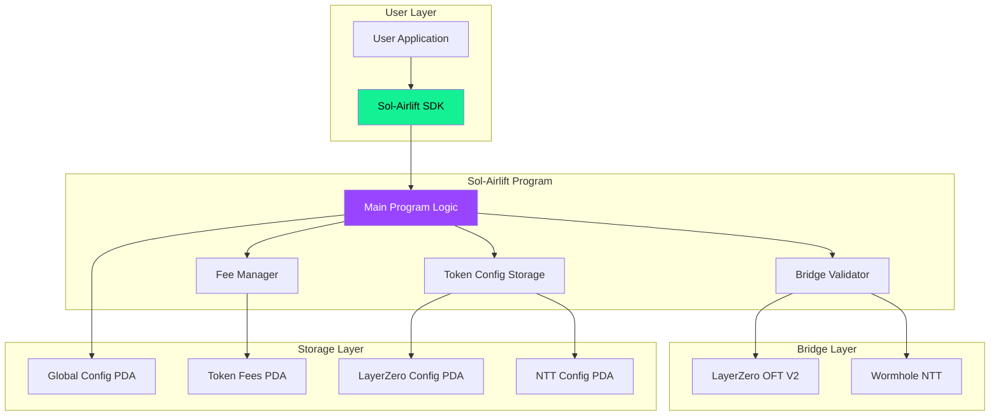
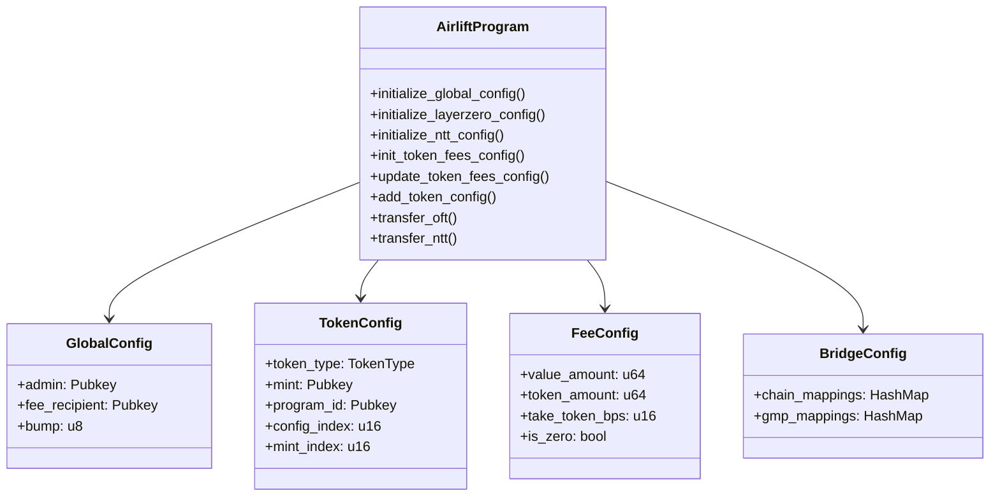
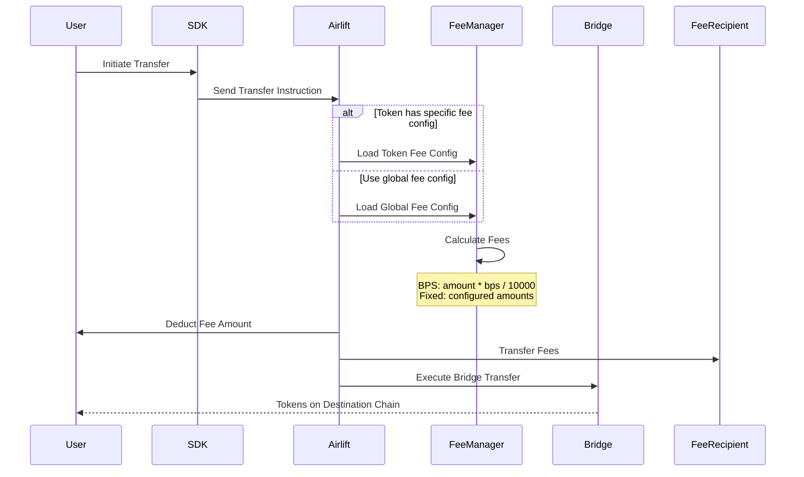
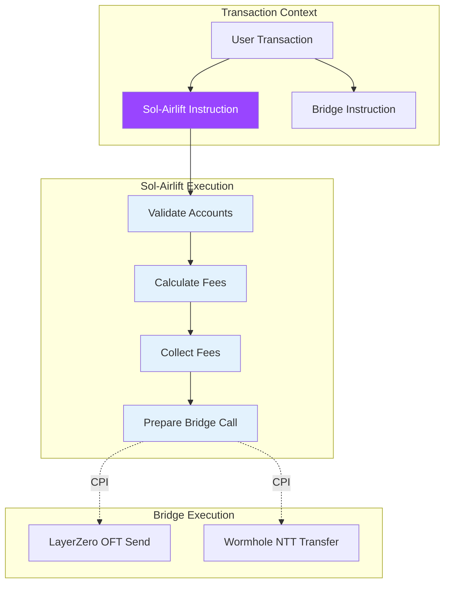
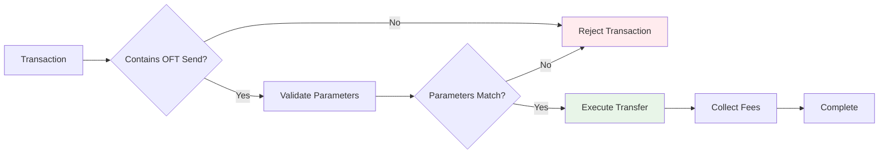
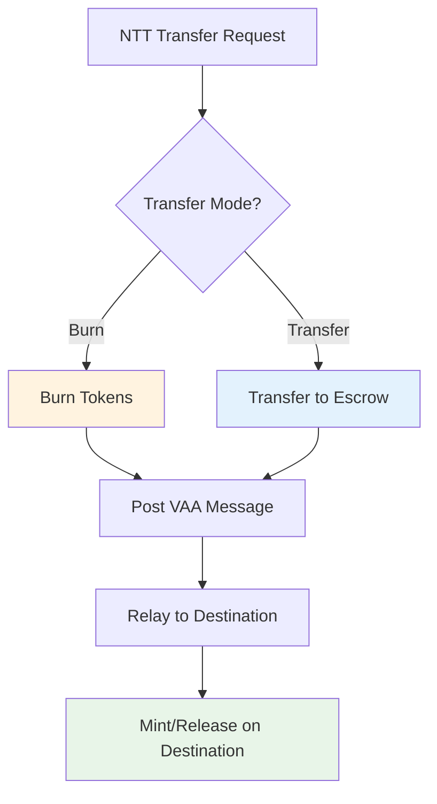
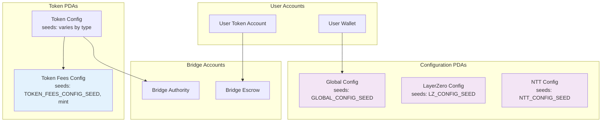
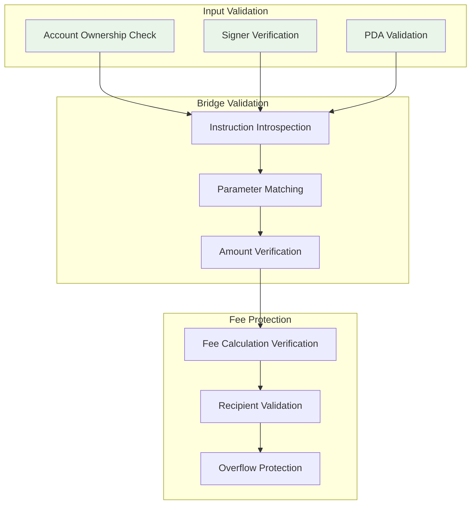
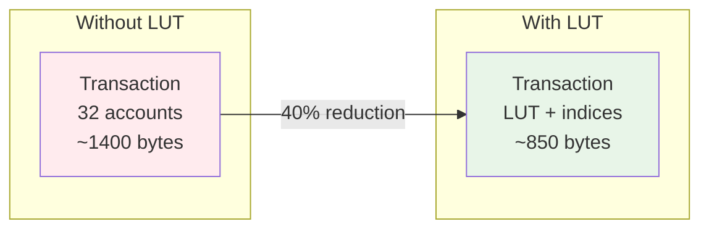

# Sol-Airlift Architecture

Sol-Airlift is designed as a modular, extensible system that integrates multiple cross-chain bridge protocols while maintaining security and efficiency. This page covers the detailed architecture, including program structure, fee mechanisms, and bridge integrations.

## System Overview

Sol-Airlift acts as a middleware layer between user applications and bridge protocols, providing a unified interface for cross-chain token transfers.

## Program Structure

The Sol-Airlift program is built using the Anchor framework and consists of several key components:

### Key Instructions

1. **Configuration Instructions**
   - `initialize_global_config`: Sets up the program admin and fee recipient
   - `initialize_layerzero_config`: Configures LayerZero-specific settings
   - `initialize_ntt_config`: Configures Wormhole NTT settings
   - `init_token_fees_config`: Creates token-specific fee configurations
   - `update_token_fees_config`: Updates existing fee configurations

2. **Token Management**
   - `add_token_config`: Registers new tokens for cross-chain transfers
   - Supports both LayerZero OFT and Wormhole NTT tokens

3. **Transfer Instructions**
   - `transfer_oft`: Executes LayerZero OFT transfers
   - `transfer_ntt`: Executes Wormhole NTT transfers

## Fee Flow Architecture

Sol-Airlift implements a sophisticated fee system that allows for flexible fee collection and distribution:

### Fee Calculation Methods

1. **Basis Points (BPS)**: Percentage-based fees
   - Formula: `fee = transferAmount * takeTokenBps / 10000`
   - Example: 50 BPS = 0.5% fee

2. **Fixed Fees**: Static amounts
   - `valueAmount`: Fee in SOL (lamports)
   - `tokenAmount`: Fee in transfer token

3. **Zero Fees**: Special configuration for fee-exempt tokens

## Bridge Integration Architecture

Sol-Airlift integrates with bridge protocols through Cross-Program Invocations (CPIs):

### LayerZero Integration

For LayerZero OFT transfers, Sol-Airlift uses instruction introspection to validate that the bridge instruction is included in the same transaction:

### Wormhole NTT Integration

Wormhole NTT integration supports both burn and transfer modes:

## Account Relationships

Sol-Airlift uses Program Derived Addresses (PDAs) for secure account management:

### PDA Seeds

- **Global Config**: `[b"GLOBAL_CONFIG"]`
- **LayerZero Config**: `[b"LZ_CONFIG"]`
- **NTT Config**: `[b"NTT_CONFIG"]`
- **Token Fees**: `[b"TOKEN_FEES_CONFIG", mint.key()]`

## Security Architecture

Sol-Airlift implements multiple security layers:

### Security Features

1. **Admin Controls**: Only admin can modify configurations
2. **Instruction Introspection**: Validates bridge instructions in same transaction
3. **Account Validation**: Ensures all accounts are properly owned and initialized
4. **Fee Protection**: Prevents fee manipulation and ensures correct distribution

## Transaction Size Optimization

Sol-Airlift uses Address Lookup Tables (LUTs) to optimize transaction size:

## Performance Considerations

1. **CPI Depth**: LayerZero requires careful management due to Solana's CPI depth limit
2. **Compute Units**: Optimized instruction execution to stay within limits
3. **Transaction Size**: LUTs enable complex operations within size constraints
4. **RPC Optimization**: SDK includes retry logic and load balancing

## Next Steps

- Learn about the [Fee System](../concepts/fee-system) in detail
- Understand [Bridge Integration](../concepts/bridge-integration) specifics
- Explore [Token Configuration](../token-management/overview) options 