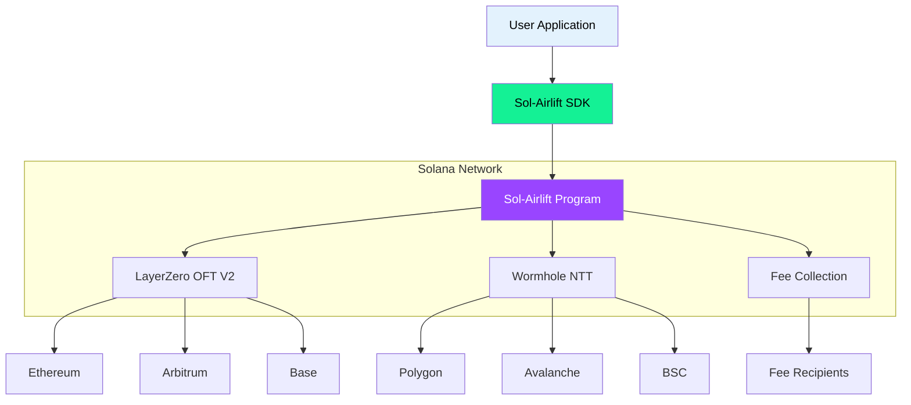

# Welcome to Sol-Airlift Documentation

Sol-Airlift is a Solana program that enables seamless cross-chain token transfers using **LayerZero V2 OFT** and **Wormhole NTT** bridges. It acts as a unified interface for multiple bridge protocols, simplifying the complexity of cross-chain operations while providing fee management and transaction optimization.

## What is Sol-Airlift?

Sol-Airlift solves the fragmentation problem in cross-chain token transfers by:

- **Unifying Multiple Bridges**: Single interface for LayerZero OFT and Wormhole NTT
- **Fee Management**: Configurable fee collection and distribution system
- **Transaction Optimization**: Address Lookup Tables (LUT) for reduced transaction size
- **Flexible Configuration**: Per-token and global fee configurations
- **Developer-Friendly SDK**: Easy integration with TypeScript/JavaScript applications

## High-Level Architecture



## Supported Bridges

### LayerZero V2 OFT
- **Protocol**: Omnichain Fungible Token (OFT) Standard V2
- **Chains**: 30+ supported networks including Ethereum, Arbitrum, Optimism, Base, Polygon
- **Features**: Mature ecosystem, wide token support, flexible configuration
- **Best For**: Established tokens with existing OFT contracts

### Wormhole NTT
- **Protocol**: Native Token Transfers (NTT) V1, V2, and V3
- **Chains**: Growing network support including major EVM chains
- **Features**: Native Solana integration, lower transaction costs, simpler architecture
- **Best For**: New tokens targeting specific high-traffic routes

## Key Benefits

<div className="feature-card">
  <h3>🚀 Simplified Integration</h3>
  <p>Single SDK and program interface for multiple bridge protocols. No need to integrate each bridge separately.</p>
</div>

<div className="feature-card">
  <h3>💰 Flexible Fee Management</h3>
  <p>Configure global or per-token fees. Support for both basis points (BPS) and fixed fee models.</p>
</div>

<div className="feature-card">
  <h3>⚡ Optimized Performance</h3>
  <p>Address Lookup Tables reduce transaction size by up to 40%, enabling more complex cross-chain operations.</p>
</div>

<div className="feature-card">
  <h3>🔒 Security First</h3>
  <p>Built on Anchor framework with comprehensive validation, instruction introspection for LayerZero, and secure fee handling.</p>
</div>

## Quick Example

```typescript
import { AirliftClient } from 'airlift-solana-sdk';

// Initialize client
const client = new AirliftClient(connection, wallet, adminWallet, "Mainnet");

// Send tokens cross-chain
const quote = await client.quoteLZ(/* ... */);
const tx = await client.sendLz(/* ... */);

console.log(`Transferred tokens! TX: ${tx}`);
```

For detailed SDK usage and examples, see the [SDK Documentation](../sdk/overview).

## Next Steps

- **[Prerequisites](../getting-started/prerequisites)**: Set up your development environment
- **[Quick Start](../getting-started/quick-start)**: Deploy and test Sol-Airlift
- **[Token Management](../token-management/overview)**: Learn how to add and configure tokens
- **[SDK Documentation](../sdk/overview)**: Integrate Sol-Airlift into your application

## Getting Help

- **GitHub**: [github.com/glacislabs/sol-airlift](https://github.com/glacislabs/sol-airlift)
- **Discord**: Join our community for support
- **Documentation**: You're here! 📚

---

Ready to enable cross-chain transfers for your Solana tokens? Let's get started! 🚀 