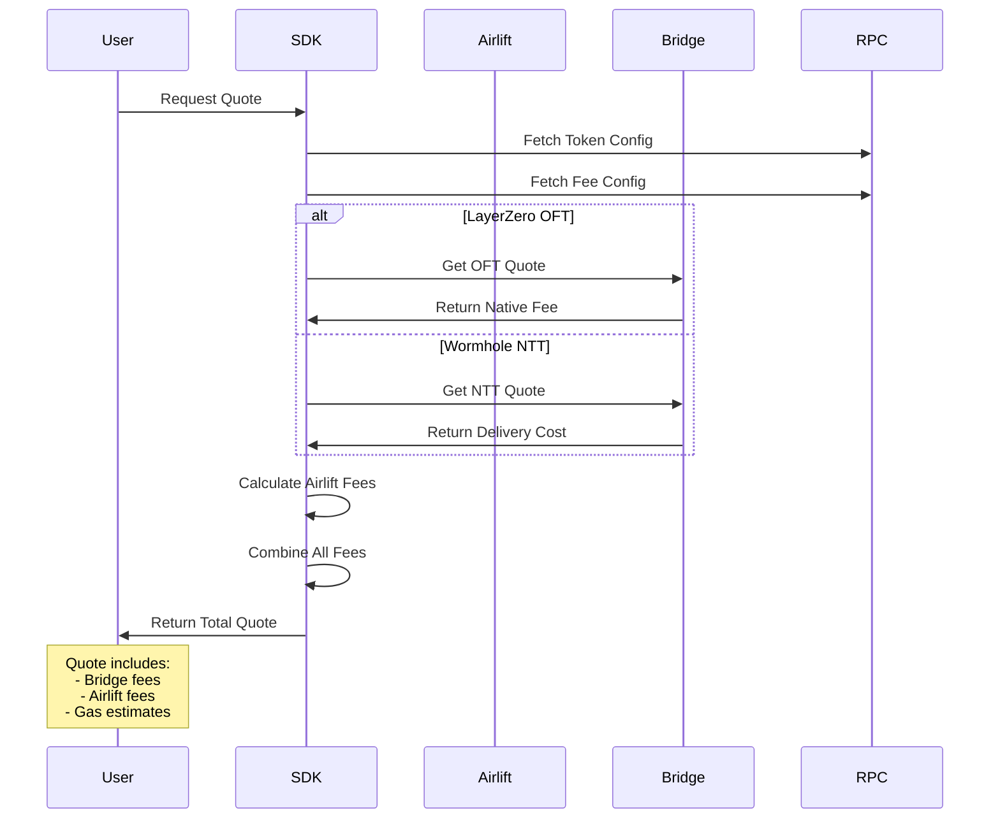

# Quote Generation

Quote generation is a critical step in cross-chain transfers. A quote provides the total cost estimate including bridge fees and Sol-Airlift fees. This guide covers quote generation for both LayerZero OFT and Wormhole NTT transfers.

## Overview of Quote Flow



## LayerZero OFT Quote Generation

### Implementation Example

Based on the actual implementation in `send-mainnet-lz.ts`:

```typescript
import * as anchor from "@coral-xyz/anchor";
import { AirliftClient } from "airlift-solana-sdk";
import { EndpointId } from "@layerzerolabs/lz-definitions";
import { Connection, PublicKey, Keypair } from "@solana/web3.js";

// Initialize client
const connection = new Connection(RPC_URL, "confirmed");
const client = new AirliftClient(connection, userKeypair, adminKeypair, "Mainnet");

// Token configuration
const mint = new PublicKey(tokenConfig.solana.token);
const oftProgramId = new PublicKey(tokenConfig.solana.oftProgramId);
const oftTokenEscrow = tokenConfig.solana.tokenEscrow;

// Quote parameters
const endpointId = EndpointId.SOLANA_V2_MAINNET;
const destinationEid = getDstEidFromChainId(chainId); // e.g., Ethereum = 30101
const recipientAddress = "0x742d35Cc6634C0532925a3b844Bc9e7595f7E3d2";
const amount = new anchor.BN(1_000_000_000); // 1 token with 9 decimals

// Get fee configuration for the token
const feeConfig = await client.getFeeConfigForToken(mint);

// Get LayerZero quote
const quote = await client.quoteLZ(
  endpointId,                    // Source endpoint ID
  userKeypair,                   // Payer keypair
  recipientAddress,              // Destination address
  oftProgramId,                  // OFT program ID
  oftTokenEscrow,                // Token escrow account
  mint,                          // Token mint
  destinationEid,                // Destination endpoint ID
  amount,                        // Amount to transfer
  feeConfig,                     // Fee configuration
  tokenConfig.gmpParameters      // Optional GMP parameters from config
);

console.log('Quote breakdown:');
console.log('- LayerZero Fee:', quote.feeCosts.bridgeFee.nativeFee.toString(), 'lamports');
console.log('- Airlift Fee:', quote.feeCosts.airliftFee.nativeFee.toString(), 'lamports');
console.log('- Token Fee:', quote.feeCosts.airliftFee.tokenFee.toString());
```

### Key Parameters Explained

#### EndpointId
- `EndpointId.SOLANA_V2_MAINNET`: For mainnet (40168)
- `EndpointId.SOLANA_V2_TESTNET`: For testnet

#### GMP Parameters
Generic Message Passing parameters that can be configured per token:
```typescript
// From token config file
{
  "gmpParameters": "0x00030100110100000000000000000000000000030d40"
}
```

#### Destination Endpoint IDs
Common destination endpoint IDs for LayerZero:
- Ethereum: 30101
- Arbitrum: 30110
- Optimism: 30111
- Base: 30184
- Polygon: 30109

### Fee Override Option

The implementation supports overriding quoted fees with known working amounts:

```typescript
// Configuration options
const USE_FIXED_FEE = true;  // Use fixed fee instead of quote
const FIXED_FEE_LAMPORTS = new anchor.BN(10_000_000); // 0.01 SOL

// After getting quote
const layerZeroFee = USE_FIXED_FEE ? FIXED_FEE_LAMPORTS : quote.feeCosts.bridgeFee.nativeFee;
```

## Wormhole NTT Quote Generation

### Implementation Example

Based on the actual implementation in `send-mainnet-ntt.ts`:

```typescript
import { AirliftClient } from "../sdk/src/services/airlift";
import { ChainName } from "./types";
import { getRecipientChainId, ethAddressToBytes32 } from "./utils";

// Initialize client
const client = new AirliftClient(connection, userKeypair, null, "Mainnet");

// Token configuration (from NTT token config file)
const tokenMint = new PublicKey(tokenConfig.solana.token);
const nttConfig = tokenConfig.solana; // Contains NTT-specific config

// Transfer parameters
const amount = 1; // Human-readable amount
const destinationChain = ChainName.Ethereum;
const destinationAddress = "0x9D3363d9e21bf5C3fF1da7E5322d559Db3b8a8bf";

// Convert amount to smallest units
const totalSendAmount = getAmountFromDecimals(amount, tokenConfig.decimals);

// Get recipient chain ID from token config
const recipientChainId = getRecipientChainId(tokenConfig, destinationChain);

// Convert Ethereum address to bytes32 format
const recipientAddress = ethAddressToBytes32(destinationAddress);

// Get transfer instructions with quote
const sendIxsInfo = await client.getSendNttIxs(
  userKeypair.publicKey,       // User public key
  tokenMint,                    // Token mint
  nttConfig,                    // NTT configuration object
  totalSendAmount,              // Amount in smallest units
  recipientAddress,             // Recipient as byte array
  recipientChainId,             // Destination chain ID
  false                         // automatic (false = manual relay)
);
```

### NTT Configuration Structure

The NTT configuration object contains:
```typescript
interface NttSolanaConfig {
  manager: string;              // NTT manager program
  transceiver: string;          // Wormhole transceiver
  quoter: string;               // Quote program
  token: string;                // Token mint address
  tokenAuthority: string;       // Token authority
  // ... other fields
}
```

### Utility Functions

#### Convert Amount to Decimals
```typescript
function getAmountFromDecimals(amount: number, decimals: number): anchor.BN {
  return new anchor.BN(Math.floor(amount * Math.pow(10, decimals)));
}
```

#### Convert Ethereum Address to Bytes32
```typescript
function ethAddressToBytes32(address: string): number[] {
  // Remove 0x prefix and pad to 32 bytes
  const cleanAddress = address.replace('0x', '');
  const padded = cleanAddress.padStart(64, '0');
  return Array.from(Buffer.from(padded, 'hex'));
}
```

#### Get Recipient Chain ID
```typescript
function getRecipientChainId(tokenConfig: any, chainName: ChainName): number {
  // Extract chain ID from token config based on chain name
  const chainConfig = tokenConfig.contracts[chainName];
  return chainConfig.chainId;
}
```

## Complete Transfer Example

### LayerZero OFT Transfer

```typescript
// After getting quote and building instructions
const sendIxsInfo = await client.getSendLzIxsInner(
  endpointId,
  amount,
  userKeypair,
  Array.from(recipientAddressBytes),
  recipientAddressBytes,
  destinationEid,
  chainId,
  mint,
  userTokenAccount,
  oftProgramId,
  oftTokenEscrow,
  TOKEN_PROGRAM_ID,
  tokenConfig.decimals,
  layerZeroFee  // Use quoted or fixed fee
);

// Create versioned transaction with LUT
const lookupTableAccount = await connection.getAddressLookupTable(lutAddress);
const message = new TransactionMessage({
  payerKey: userKeypair.publicKey,
  recentBlockhash: blockhash,
  instructions: sendIxsInfo.instructions,
}).compileToV0Message([lookupTableAccount.value]);

const transaction = new VersionedTransaction(message);
transaction.sign([userKeypair, ...sendIxsInfo.signers]);

const txid = await connection.sendTransaction(transaction);
```

### Wormhole NTT Transfer

```typescript
// Build transaction with LUT
const lookupTableAccount = await connection.getAddressLookupTable(lutAddress);
const message = new TransactionMessage({
  payerKey: userKeypair.publicKey,
  recentBlockhash: blockhash,
  instructions: sendIxsInfo.instructions,
}).compileToV0Message(
  sendIxsInfo.luts.length ? sendIxsInfo.luts : [lookupTableAccount.value]
);

const transaction = new VersionedTransaction(message);
transaction.sign([userKeypair, ...sendIxsInfo.signers]);

const txid = await connection.sendTransaction(transaction);
```

## Important Considerations

### 1. Address Lookup Tables (LUTs)
Both LayerZero and NTT transfers require LUTs to fit within Solana's transaction size limit:
```typescript
// LUTs are essential - transactions will fail without them
const lutAddress = LOOKUP_TABLE_ADDRESSES[tokenSymbol];
```

### 2. Account Creation
Ensure fee recipient token accounts exist:
```typescript
await getOrCreateAssociatedTokenAccount(
  connection,
  admin,
  tokenMint,
  admin.publicKey,
  false,
  "confirmed"
);
```

### 3. Balance Checks
Always verify balances before transfers:
```typescript
const userBalance = await connection.getTokenAccountBalance(userTokenAccount);
if (!userBalance.value.uiAmount || userBalance.value.uiAmount < amount) {
  throw new Error(`Insufficient balance: ${userBalance.value.uiAmount}`);
}

// Also check SOL balance for fees
const solBalance = await connection.getBalance(user.publicKey);
const MIN_SOL_BALANCE = 0.01; // Minimum for transaction fees
if (solBalance < MIN_SOL_BALANCE * 1e9) {
  throw new Error(`Insufficient SOL balance`);
}
```

### 4. Error Handling
Implement proper error handling:
```typescript
try {
  const txid = await connection.sendTransaction(transaction);
  console.log(`Transaction: https://solscan.io/tx/${txid}`);
} catch (error) {
  console.error("Transfer failed:", error);
  // Check specific error types
  if (error.message.includes("insufficient")) {
    // Handle insufficient balance
  }
}
```

## Troubleshooting Common Issues

### Issue: "Transaction too large"
**Solution**: Ensure you're using the correct LUT for your token:
```typescript
const lutAddress = LOOKUP_TABLE_ADDRESSES[tokenSymbol];
if (!lutAddress) {
  throw new Error(`No LUT configured for ${tokenSymbol}`);
}
```

### Issue: "Underquoted fees"
**Solution**: LayerZero quotes can sometimes be insufficient. Use the fee override:
```typescript
const FIXED_FEE_LAMPORTS = new anchor.BN(10_000_000); // 0.01 SOL
const layerZeroFee = FIXED_FEE_LAMPORTS; // Known working amount
```

### Issue: "Account not found"
**Solution**: Ensure all required accounts are created before the transfer:
- User token account
- Fee recipient token account
- Program PDAs are initialized

## Best Practices

1. **Always use LUTs** - Required for transaction size optimization
2. **Check balances** - Verify both token and SOL balances
3. **Handle errors gracefully** - Provide clear error messages
4. **Use appropriate RPC** - High-performance RPC for mainnet
5. **Test on devnet first** - Verify configuration before mainnet

## Next Steps

- Review [Address Lookup Tables](../lut/creating-luts) for LUT creation
- Understand [Fee Configuration](../token-management/fee-configuration)
- Explore [Complete Examples](../examples/scripts) for more transfer scenarios 