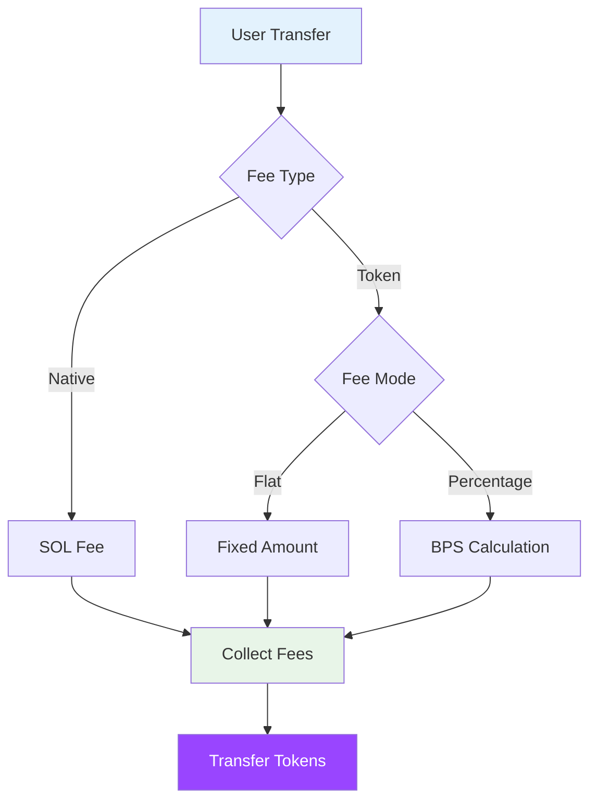

# Fee Configuration

This guide covers how to configure and manage fees for tokens in Sol-Airlift.

## Overview

Sol-Airlift uses a flexible fee system that supports both native SOL fees and token-based fees.



## Fee Structure

### Fee Components

```typescript
interface FeeConfig {
  valueAmount: number;      // Native SOL fee in lamports
  tokenAmount: number;      // Token fee amount
  takeTokenBps: boolean;    // true = percentage, false = flat
  isZero: boolean;         // true = no fees
}
```

### Fee Types

1. **Native Fee**: SOL collected for transfers
2. **Token Fee**: Either flat amount or percentage (BPS)
3. **Zero Fee**: Disabled fees for specific tokens

## Setting Global Fees

### Initialize Global Configuration

```bash
# Set global default fees
ts-node scripts/set-global-fees.ts \
  --native-fee 0.001 \
  --token-fee 20 \
  --type bps

# Output:
# 💰 Setting global fee configuration...
# ✅ Native fee: 0.001 SOL
# ✅ Token fee: 20 BPS (0.2%)
# 📊 Transaction: 2xK9n...
```

### Using SDK

```typescript
import { AirliftClient } from 'airlift-solana-sdk';

const client = new AirliftClient(connection, adminKeypair, adminKeypair, "Mainnet");

// Set global fees
await client.setGlobalFees({
  valueAmount: new BN(1_000_000),    // 0.001 SOL
  tokenAmount: new BN(20),           // 20 BPS
  takeTokenBps: true,                // Use percentage
  isZero: false                      // Fees enabled
});
```

## Token-Specific Fees

### Configure Individual Token

```bash
# Set flat fee for stablecoin
ts-node scripts/set-token-fee.ts \
  --token USDC \
  --native-fee 0.0005 \
  --token-fee 0.01 \
  --type flat

# Set percentage fee for volatile token
ts-node scripts/set-token-fee.ts \
  --token BONK \
  --native-fee 0.001 \
  --token-fee 50 \
  --type bps
```

### Fee Calculation Examples

```typescript
// Flat fee: Always charges fixed amount
// Config: { tokenAmount: 1000000, takeTokenBps: false }
// Transfer 100 USDC → Fee: 1 USDC
// Transfer 1000 USDC → Fee: 1 USDC

// Percentage fee: Charges based on amount
// Config: { tokenAmount: 20, takeTokenBps: true }
// Transfer 100 USDC → Fee: 0.02 USDC (0.2%)
// Transfer 1000 USDC → Fee: 0.2 USDC (0.2%)
```

## Fee Management Script

### Bulk Update Fees

```typescript
// scripts/manage-token-fees.ts
import { TokenFeeManager } from '../utils/token-fee-manager';

const manager = new TokenFeeManager(connection, adminKeypair);

// Update multiple tokens
const updates = [
  { token: 'USDC', nativeFee: 0.0005, tokenFee: 15, type: 'bps' },
  { token: 'USDT', nativeFee: 0.0005, tokenFee: 15, type: 'bps' },
  { token: 'WSOL', nativeFee: 0.001, tokenFee: 20, type: 'bps' },
  { token: 'BONK', nativeFee: 0.001, tokenFee: 100, type: 'flat' },
];

for (const update of updates) {
  await manager.updateTokenFee(update);
}
```

### Validate Fees

```bash
# Check current fee configuration
ts-node scripts/validate-fees.ts

# Output:
# 📊 Fee Configuration Report
# 
# Global Fees:
# - Native: 0.001 SOL
# - Token: 20 BPS
# 
# Token-Specific Fees:
# USDC: 0.0005 SOL + 15 BPS
# USDT: 0.0005 SOL + 15 BPS
# WSOL: 0.001 SOL + 20 BPS
# BONK: 0.001 SOL + 100 BONK (flat)
```

## Fee Configuration File

### Structure

```json
{
  "globalConfig": {
    "valueAmount": 1000000,
    "tokenAmount": 20,
    "takeTokenBps": true,
    "isZero": false,
    "feeRecipients": ["9WzDXwBbmkg8ZTbNMqUxvQRAyrZzDsGYdLVL9zYtAZWPk"]
  },
  "tokens": {
    "ntt": {
      "EPjFWdd5AufqSSqeM2qN1xzybapC8G4wEGGkZwyTDt1v": {
        "name": "USDC",
        "feeConfig": {
          "valueAmount": 500000,
          "tokenAmount": 15,
          "takeTokenBps": true,
          "isZero": false
        },
        "lastUpdated": "2024-01-15T10:30:00Z"
      }
    },
    "oft": {
      "So11111111111111111111111111111111111111112": {
        "name": "WSOL",
        "feeConfig": {
          "valueAmount": 1000000,
          "tokenAmount": 20,
          "takeTokenBps": true,
          "isZero": false
        },
        "lastUpdated": "2024-01-15T10:35:00Z"
      }
    }
  }
}
```

### Apply Configuration

```bash
# Apply fee configuration from file
ts-node scripts/apply-fee-config.ts \
  --config ../config/token-fees.json \
  --network mainnet

# Output:
# 📖 Reading fee configuration...
# ✅ Global fees updated
# ✅ USDC fees updated
# ✅ WSOL fees updated
# 📊 2 tokens updated successfully
```

## Fee Strategies

### Stablecoins

```typescript
// Low percentage fees for stablecoins
const stablecoinFees = {
  valueAmount: 500000,    // 0.0005 SOL
  tokenAmount: 10,        // 0.1%
  takeTokenBps: true,
  isZero: false
};
```

### High-Value Tokens

```typescript
// Higher percentage for valuable tokens
const highValueFees = {
  valueAmount: 1000000,   // 0.001 SOL
  tokenAmount: 25,        // 0.25%
  takeTokenBps: true,
  isZero: false
};
```

### Meme Tokens

```typescript
// Flat fees for volatile tokens
const memeTokenFees = {
  valueAmount: 1000000,   // 0.001 SOL
  tokenAmount: 1000000,   // Fixed amount
  takeTokenBps: false,    // Flat fee
  isZero: false
};
```

## Zero Fee Tokens

### Disable Fees

```bash
# Set zero fees for specific token
ts-node scripts/set-token-fee.ts \
  --token CHARITY \
  --zero-fee

# Output:
# 💰 Setting zero fee configuration...
# ✅ Fees disabled for CHARITY
# 📊 Transaction: 7xM2n...
```

### Programmatic Zero Fees

```typescript
// Disable fees for a token
await client.setTokenFee(charityMint, {
  valueAmount: new BN(0),
  tokenAmount: new BN(0),
  takeTokenBps: false,
  isZero: true  // Important: Set this flag
});
```

## Fee Collection

### Monitor Collected Fees

```bash
# Check fee collection stats
ts-node scripts/fee-stats.ts --period 7d

# Output:
# 📊 Fee Collection Report (Last 7 Days)
# 
# Total Native Fees: 125.5 SOL
# 
# Token Fees:
# - USDC: 450.25 USDC
# - USDT: 380.10 USDT
# - WSOL: 15.8 WSOL
# 
# Top Tokens by Volume:
# 1. USDC: 2,250,000 transferred
# 2. USDT: 1,900,000 transferred
# 3. WSOL: 790 transferred
```

### Withdraw Collected Fees

```typescript
// Withdraw fees to treasury
const treasury = new PublicKey("TreasuryWallet...");

await client.withdrawFees({
  recipient: treasury,
  tokenMint: usdcMint,  // Specify token to withdraw
  amount: "max"         // Or specific amount
});
```

## Best Practices

### 1. Fee Tiers

Create fee tiers based on token characteristics:

```typescript
const feeTiers = {
  stable: { native: 0.0005, token: 10 },     // 0.1%
  volatile: { native: 0.001, token: 25 },    // 0.25%
  meme: { native: 0.001, token: 50 },        // 0.5%
  premium: { native: 0.002, token: 5 }       // 0.05%
};
```

### 2. Regular Reviews

```bash
# Monthly fee review script
ts-node scripts/monthly-fee-review.ts

# Analyzes:
# - Fee collection vs gas costs
# - Token volume changes
# - User feedback
# - Competitor fees
```

### 3. Dynamic Adjustments

```typescript
// Adjust fees based on network conditions
if (networkCongested) {
  // Increase native fee during congestion
  await updateNativeFee(currentFee * 1.5);
}

if (tokenVolume > threshold) {
  // Reduce percentage for high volume
  await updateTokenFee(currentBps * 0.8);
}
```

## Troubleshooting

### "Insufficient fee payment"

User didn't include enough SOL for fees:
```typescript
// Calculate required fees upfront
const fees = await client.calculateFees(amount, tokenMint);
console.log(`Required SOL: ${fees.native / LAMPORTS_PER_SOL}`);
```

### "Fee config not found"

Token uses global fees if no specific config:
```bash
# Check if token has specific fees
ts-node scripts/check-token-fee.ts --token YOUR_TOKEN
```

### "Fee exceeds transfer amount"

Percentage fees too high for small transfers:
```typescript
// Set minimum transfer amount
const minTransfer = (flatFee * 100) / bps; // 100x the fee
```

## Next Steps

- [Create fee reports](../troubleshooting/common-issues) for accounting
- [Optimize gas costs](../lut/creating-luts) with LUTs
- [Monitor fee collection](../examples/scripts) with scripts 