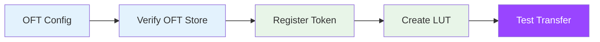

# LayerZero OFT Setup

This guide covers adding LayerZero Omnichain Fungible Token (OFT) V2 tokens to Sol-Airlift.

## Overview

LayerZero OFT enables native cross-chain token transfers without wrapped assets.



## Prerequisites

- Sol-Airlift deployed and initialized
- LayerZero endpoint configured
- Admin keypair with authority

## Step 1: Gather OFT Information

### Required Information

```typescript
interface OFTTokenConfig {
  // Token basics
  mint: string;              // Token mint address
  name: string;              // Token name
  symbol: string;            // Token symbol
  decimals: number;          // Token decimals
  
  // OFT specific
  oftProgramId: string;      // OFT program address
  tokenEscrow: string;       // Token escrow account
  
  // Endpoint configurations
  endpoints: {
    [chainId: number]: {
      eid: number;         // Endpoint ID
      address: string;     // Token address on chain
    };
  };
}
```

### Find OFT Configuration

```bash
# Verify OFT configuration
ts-node scripts/verify-oft-token.ts --mint So11111111111111111111111111111111111111112

# Output:
# ✅ OFT Program: 6VQr7Qw6vKa4RVe7PQnJqKVfR7TWoFdL5qQ6jSahcWYf
# ✅ Token Escrow: 9kA7VYnFH8mPRUQ3mVKPUQJYW8Gp9hJGLXqKsFkTxPfS
# ✅ Endpoints configured: 5
```

## Step 2: Create Configuration File

Create a JSON configuration for your OFT token:

```json
{
  "name": "Wrapped SOL",
  "symbol": "WSOL",
  "type": "OFT",
  "standard": "LayerZeroV2OFT",
  "solana": {
    "token": "So11111111111111111111111111111111111111112",
    "decimals": 9,
    "oftProgramId": "6VQr7Qw6vKa4RVe7PQnJqKVfR7TWoFdL5qQ6jSahcWYf",
    "tokenEscrow": "9kA7VYnFH8mPRUQ3mVKPUQJYW8Gp9hJGLXqKsFkTxPfS"
  },
  "endpoints": {
    "30101": {
      "name": "Ethereum",
      "eid": 30101,
      "address": "0x1234567890123456789012345678901234567890"
    },
    "30110": {
      "name": "Arbitrum",
      "eid": 30110,
      "address": "0x2345678901234567890123456789012345678901"
    }
  }
}
```

## Step 3: Register Token

### Using Script

```bash
# Register OFT token
ts-node scripts/add-token-config.ts \
  --config ../config/tokens/WSOL-OFT.json \
  --type oft

# Expected output:
# 🔍 Verifying OFT configuration...
# ✅ OFT Program verified
# ✅ Token escrow verified
# 📝 Registering token...
# ✅ Token registered successfully
# 📊 Transaction: 4xK8n...
```

### Using SDK

```typescript
import { AirliftClient } from 'airlift-solana-sdk';

const client = new AirliftClient(connection, adminKeypair, adminKeypair, "Mainnet");

// Register OFT token
const tx = await client.setTokenConfig(
  new PublicKey("So11111111111111111111111111111111111111112"),
  {
    oftProgramId: new PublicKey("6VQr7Qw6vKa4RVe7PQnJqKVfR7TWoFdL5qQ6jSahcWYf"),
    tokenEscrow: "9kA7VYnFH8mPRUQ3mVKPUQJYW8Gp9hJGLXqKsFkTxPfS",
    tokenDecimals: 9,
  },
  "OFT"
);

console.log("Token registered:", tx);
```

## Step 4: Create Address Lookup Tables

OFT transfers require destination-specific LUTs:

```bash
# Create LUT for Ethereum destination
ts-node scripts/create-custom-lut.ts \
  --token WSOL \
  --type oft \
  --destination ethereum

# Output:
# 📋 Collecting OFT accounts for Ethereum...
# ✅ Found 22 accounts
# 📝 Creating LUT...
# ✅ LUT created: 8TjkeNxd6rkWKMgNKJDXrE2JjfeUjuXJDR7fqnTqxWnl
# 📊 Transaction: 5bC9d...
```

### Multiple Destination LUTs

```bash
# Create LUTs for all destinations
for chain in ethereum arbitrum optimism polygon bsc; do
  ts-node scripts/create-custom-lut.ts \
    --token WSOL \
    --type oft \
    --destination $chain
done
```

## Step 5: Configure Fees

Set up OFT-specific fees:

```bash
# Configure fees
ts-node scripts/set-token-fee.ts \
  --token WSOL \
  --native-fee 0.005 \
  --token-fee 15 \
  --type bps

# Output:
# 💰 Setting fee configuration...
# ✅ Native fee: 0.005 SOL
# ✅ Token fee: 15 BPS (0.15%)
# 📊 Transaction: 6yZ9m...
```

## Step 6: Test Transfer

### Get Quote

```typescript
const quote = await client.quoteLZ(
  EndpointId.SOLANA_V2_MAINNET,
  userKeypair,
  "0x742d35Cc6634C0532925a3b844Bc9e7595f7E3d2", // Recipient
  new PublicKey("6VQr7Qw6vKa4RVe7PQnJqKVfR7TWoFdL5qQ6jSahcWYf"), // OFT program
  "9kA7VYnFH8mPRUQ3mVKPUQJYW8Gp9hJGLXqKsFkTxPfS", // Token escrow
  mint,
  30101, // Ethereum endpoint
  new anchor.BN(1_000_000_000), // 1 WSOL
  feeConfig,
  gmpParameters
);

console.log("Quote received:", {
  messagingFee: quote.messagingFee.toString(),
  airliftFee: quote.airliftFee.toString(),
});
```

### Execute Transfer

```bash
# Test transfer
ts-node scripts/test-oft-transfer.ts \
  --token WSOL \
  --amount 1 \
  --destination ethereum \
  --recipient 0x742d35Cc6634C0532925a3b844Bc9e7595f7E3d2

# Output:
# 🔍 Getting quote...
# 💰 Fees:
#    - Messaging fee: 0.002 SOL
#    - Airlift fee: 0.0005 SOL
#    - Token fee: 0.0015 WSOL (0.15%)
# 📝 Sending transfer...
# ✅ Success! Transaction: 3xM7p...
# 🔗 Track on LayerZero Scan: https://layerzeroscan.com/tx/3xM7p...
```

## Common OFT Tokens

### Mainnet OFT Tokens

| Token | Mint | OFT Program |
|-------|------|-------------|
| WSOL | `So11111111111111111111111111111111111111112` | `6VQr7Qw6vKa4RVe7PQnJqKVfR7TWoFdL5qQ6jSahcWYf` |
| JitoSOL | `J1toso1uCk3RLmjorhTtrVwY9HJ7X8V9yYac6Y7kGCPn` | `8kZSTVuV7C4GD9ZVR4wDtRSXv1SvsSQPfqUbthueRNGV` |
| mSOL | `mSoLzYCxHdYgdzU16g5QSh3i5K3z3KZK7ytfqcJm7So` | `9tAQtG8i8VPLmS8Ce8x4nBVg5VjCPN5nqLfKvSXaLwtz` |

## Advanced Configuration

### Multi-Endpoint Setup

```typescript
// Configure multiple endpoints
const endpoints = [
  { chainId: 30101, name: "Ethereum" },
  { chainId: 30110, name: "Arbitrum" },
  { chainId: 30111, name: "Optimism" },
  { chainId: 30109, name: "Polygon" },
];

for (const endpoint of endpoints) {
  // Create endpoint-specific LUT
  await createCustomLUT(token, endpoint.chainId);
  
  // Configure endpoint-specific parameters
  await configureEndpoint(token, endpoint);
}
```

### Gas Optimization

```typescript
// Optimize gas for different chains
const gasConfigs = {
  30101: { gasLimit: 200000, gasPrice: "auto" },     // Ethereum
  30110: { gasLimit: 150000, gasPrice: "auto" },     // Arbitrum
  30109: { gasLimit: 100000, gasPrice: "auto" },     // Polygon
};
```

## Troubleshooting

### "OFT Program not found"

```bash
# Verify OFT program exists
solana account [OFT_PROGRAM_ADDRESS] -u m

# Check if it's an OFT program
anchor idl fetch [OFT_PROGRAM_ADDRESS] -u m
```

### "Invalid endpoint configuration"

Common causes:
- Endpoint ID mismatch
- Missing endpoint in LUT
- Incorrect chain configuration

```bash
# Debug endpoint configuration
ts-node scripts/debug-oft-endpoint.ts \
  --token WSOL \
  --endpoint 30101
```

### "Transaction too large"

OFT transactions can be large. Solutions:
1. Use destination-specific LUTs
2. Optimize account ordering
3. Remove unnecessary accounts

```bash
# Analyze transaction size
ts-node scripts/analyze-tx-size.ts \
  --token WSOL \
  --destination ethereum
```

## Best Practices

1. **Create destination-specific LUTs** for each endpoint
2. **Test with small amounts** before large transfers
3. **Monitor gas prices** on destination chains
4. **Keep endpoint configurations updated**
5. **Use appropriate fees** based on token value

## Security Considerations

### Escrow Verification

Always verify the token escrow:

```typescript
// Verify escrow ownership
const escrowInfo = await connection.getAccountInfo(tokenEscrow);
const escrowData = SPL_TOKEN.unpackAccount(tokenEscrow, escrowInfo);

assert(escrowData.owner.equals(oftProgramId), "Invalid escrow owner");
assert(escrowData.mint.equals(mint), "Escrow mint mismatch");
```

### Program Authority

Check OFT program authority:

```typescript
// Verify program upgrade authority
const programAccount = await connection.getAccountInfo(oftProgramId);
// Ensure it's a valid program with expected authority
```

## Next Steps

- [Configure fees](./fee-configuration) for your OFT tokens
- [Create optimized LUTs](../lut/creating-luts) for each destination
- [Monitor transfers](../troubleshooting/common-issues) across chains 