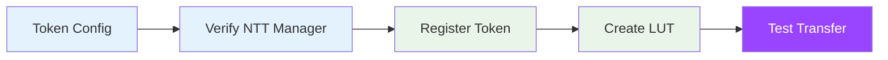

# Wormhole NTT Token Setup

This guide covers adding Wormhole Native Token Transfer (NTT) tokens to Sol-Airlift, including both SPL Token and Token-2022 standards.

## Overview

Native Token Transfer (NTT) is Wormhole's framework for transferring tokens across blockchains while maintaining their native properties. Sol-Airlift enhances NTT with additional features including fee management, automatic dust handling, and Token-2022 support.



## Token Standards Support

### SPL Token (Legacy)
Traditional Solana tokens using the SPL Token program are fully supported with:
- Standard mint/burn and lock/release mechanisms
- Associated Token Account (ATA) management
- Existing ecosystem compatibility

### Token-2022 Support
Sol-Airlift provides first-class support for Token-2022 (Token Extensions) tokens:
- **Automatic Detection**: The protocol automatically detects whether a token uses SPL Token or Token-2022
- **ATA Compatibility**: Correctly derives Associated Token Accounts for Token-2022 mints
- **Extension Support**: Compatible with Token-2022 extensions like transfer fees, metadata, and more
- **Seamless Integration**: No additional configuration required - Token-2022 tokens work out of the box

#### Example Token-2022 Tokens
- **sUSD** (susdabGDNbhrnCa6ncrYo81u4s9GM8ecK2UwMyZiq4X) - Uses Token-2022 program
- Future Token-2022 deployments are automatically supported

## Transfer Modes

### TransferBurn Mode
Tokens are burned on the source chain and minted on the destination chain.
- **Instruction**: `[75, 144, 26, 232, 39, 12, 75, 222]`
- **Wrapper Token**: Points to the mint itself
- **Use Case**: Tokens with unlimited supply or rebasing mechanisms

### TransferLock Mode
Tokens are locked in custody on the source chain and released on the destination.
- **Instruction**: `[179, 158, 146, 148, 151, 46, 176, 200]`
- **Wrapper Token**: Points to custody ATA owned by token_authority PDA
- **Use Case**: Fixed supply tokens or canonical representations

## Prerequisites

- Sol-Airlift deployed and initialized
- Access to NTT token configuration
- Admin keypair with authority

## Step 1: Gather Token Information

### Required Information

```typescript
interface NTTTokenConfig {
  // Token basics
  mint: string;                    // Token mint address
  name: string;                    // Token name
  symbol: string;                  // Token symbol
  decimals: number;                // Token decimals
  
  // NTT specific
  manager: string;                 // NTT Manager address
  transceiver: string;            // Transceiver address
  quoter?: string;                // Optional quoter
  transferInstruction: string;     // Base58 encoded instruction discriminator
  
  // Per-chain configurations
  chains: {
    [chainId: number]: {
      tokenAddress: string;      // Token on destination
      transceiverAddress: string; // Chain transceiver
    };
  };
}
```

### Find NTT Configuration

```bash
# Check if token has NTT manager
ts-node scripts/verify-ntt-token.ts --mint EPjFWdd5AufqSSqeM2qN1xzybapC8G4wEGGkZwyTDt1v

# Output:
# ✅ NTT Manager found: NTtDqe4fqCCPGA3KPPKqPeU2JbCeAjPkKECBx23YmvK
# ✅ Transceiver: 5pXSnn8AF5AqP7pqVJJapqKRcdqFXw95qznVsjmVmatU
# ✅ Transfer Mode: TransferBurn
```

### Token Program Detection
```typescript
// Automatic detection of token program
const mintInfo = await connection.getAccountInfo(mint);
const tokenProgram = mintInfo?.owner.equals(TOKEN_2022_PROGRAM_ID) 
  ? TOKEN_2022_PROGRAM_ID 
  : TOKEN_PROGRAM_ID;

// Derive ATA with correct program
const ata = getAssociatedTokenAddressSync(
  mint,
  owner,
  allowOwnerOffCurve,
  tokenProgram
);
```

## Step 2: Create Configuration File

Create a JSON configuration file for your NTT token:

```json
{
  "name": "USD Coin",
  "symbol": "USDC",
  "type": "NTT",
  "standard": "NTTV2",
  "solana": {
    "token": "EPjFWdd5AufqSSqeM2qN1xzybapC8G4wEGGkZwyTDt1v",
    "decimals": 6,
    "manager": "NTtDqe4fqCCPGA3KPPKqPeU2JbCeAjPkKECBx23YmvK",
    "transceiver": "5pXSnn8AF5AqP7pqVJJapqKRcdqFXw95qznVsjmVmatU",
    "quoter": "Quoter11111111111111111111111111111111111",
    "transferInstruction": "TransferBurn"
  },
  "chains": {
    "1": {
      "name": "Ethereum",
      "address": "0xA0b86991c6218b36c1d19D4a2e9Eb0cE3606eB48",
      "transceiver": "0x3F5A90442C7F717897d532F5E32BFDFce1fD31BE",
      "decimals": 6
    },
    "42161": {
      "name": "Arbitrum",
      "address": "0xaf88d065e77c8cC2239327C5EDb3A432268e5831",
      "transceiver": "0x4CB69FaE7e7Af841e44E1A1c30Af640739378bb5",
      "decimals": 6
    },
    "10": {
      "name": "Optimism",
      "address": "0x0b2C639c533813f4Aa9D7837CAf62653d097Ff85",
      "transceiver": "0x2eA6c42dC31A0158bD7E65a6A7b27f5F4933929E",
      "decimals": 6
    }
  }
}
```

## Step 3: Register Token (Script)

Use the registration script:

```bash
# Register NTT token
ts-node scripts/add-token-config.ts \
  --config ../config/tokens/USDC-NTT.json \
  --type ntt

# Verify registration
ts-node scripts/verify-token.ts --token USDC --type ntt
```

## Step 3: Register Token (SDK)

```typescript
import { AirliftClient } from 'airlift-solana-sdk';

// Initialize client
const client = new AirliftClient(connection, userKeypair, adminKeypair);

// Register NTT token
await client.registerNttToken({
  mint: new PublicKey("EPjFWdd5AufqSSqeM2qN1xzybapC8G4wEGGkZwyTDt1v"),
  manager: new PublicKey("NTtDqe4fqCCPGA3KPPKqPeU2JbCeAjPkKECBx23YmvK"),
  transceiver: new PublicKey("5pXSnn8AF5AqP7pqVJJapqKRcdqFXw95qznVsjmVmatU"),
  // Additional config...
});
```

## Step 4: Create Address Lookup Table

LUTs are required for NTT transfers to fit within transaction size limits:

```bash
# Create LUT for all chains
ts-node scripts/create-lut.ts --token USDC --type ntt

# Create LUT for specific chain
ts-node scripts/create-custom-lut.ts \
  --token USDC \
  --type ntt \
  --destination ethereum
```

## Step 5: Configure Fees

Set token-specific fees:

```bash
# Set 0.1% token fee + 0.001 SOL native fee
ts-node scripts/set-token-fee.ts \
  --token USDC \
  --native-fee 0.001 \
  --token-fee 10 \
  --type bps
```

## Step 6: Test Transfer

```typescript
// Get quote
const quote = await client.quoteNtt(
  userPublicKey,
  mint,
  nttConfig,
  amount,
  recipientChain,
  recipientAddress
);

// Execute transfer
const { tx, luts } = await client.getSendNttIxs(
  userPublicKey,
  mint,
  nttConfig,
  amount,
  recipientAddress,
  recipientChain,
  false // manual relay
);

// Send transaction
const signature = await sendTransaction(tx, connection, {
  addressLookupTableAccounts: luts
});
```

## Common NTT Tokens

| Token | Mint | Manager | Mode |
|-------|------|---------|------|
| USDC | EPjFWdd5AufqSSqeM2qN1xzybapC8G4wEGGkZwyTDt1v | NTtDqe4fqCCPGA3KPPKqPeU2JbCeAjPkKECBx23YmvK | Burn |
| W | 85VBFQZC9TZkfaptBWjvUw7YbZjy52A6mjtPGjstQAmQ | NTtAaoDJhkeHeaVUHnyhwbPNAN6WgBpHkHBTc6d7vLK | Burn |
| sUSD | susdabGDNbhrnCa6ncrYo81u4s9GM8ecK2UwMyZiq4X | (Token-2022) | Lock |

## Technical Details

### Account Structure
The NTT integration manages several key accounts:

1. **NTT Manager**: The main program managing transfers
2. **Token Authority PDA**: Derived as `["token_authority"]` - owns custody accounts
3. **Custody Account**: For lock mode, an ATA owned by the token authority
4. **Wrapper Token**: Configuration pointing to either mint (burn) or custody ATA (lock)

### Dust Handling
Sol-Airlift automatically handles decimal differences between chains:
- Calculates dust based on source and destination decimals
- Trims amounts to prevent precision loss
- Adds dust to fee amounts to ensure no tokens are lost

### Fee Structure

NTT transfers incur several types of fees:

1. **Native SOL Fees**: Configured per-token for transaction costs
2. **Token Fees**: Optional percentage or fixed fees in the transferred token
3. **Relayer Fees**: Wormhole relayer fees for automatic delivery
4. **Dust Fees**: Trimmed amounts due to decimal differences

## Troubleshooting

### Common Issues

**"Invalid NTT Manager"**
- Verify manager address is correct
- Check token is properly configured for NTT
- Ensure manager is initialized on-chain

**"Token program mismatch"**
- SDK automatically detects token program
- Ensure using latest SDK version
- Check mint account owner

**"Transaction too large"**
- Create or use appropriate LUT
- Reduce number of accounts if possible
- Check all accounts are in LUT

**"Invalid wrapper token"**
- Run setup scripts to update configuration
- Verify transfer mode matches on-chain state
- Check custody account for lock mode

### Debug Commands

```bash
# Check token configuration
ts-node scripts/debug-token.ts --token USDC --type ntt

# Verify on-chain state
ts-node scripts/verify-ntt-state.ts --token USDC

# Test small transfer
ts-node scripts/test-transfer.ts \
  --token USDC \
  --amount 0.01 \
  --destination ethereum
```

## Advanced Configuration

### Custom Fee Recipients

```typescript
await client.setTokenFeeRecipient(
  mint,
  customFeeRecipient,
  adminKeypair
);
```

### Per-Chain Configuration

```typescript
await client.updateNttChainConfig(
  mint,
  chainId,
  {
    enabled: true,
    minAmount: new BN(1000000), // 1 USDC minimum
    maxAmount: new BN(10000000000), // 10k USDC maximum
  }
);
```

## Best Practices

1. **Always test on devnet first**
   - Use devnet tokens and endpoints
   - Verify all configurations
   - Test edge cases

2. **Monitor transfer status**
   - Check Wormhole scan for VAA status
   - Verify destination chain receipt
   - Handle relay failures

3. **Handle Token-2022 properly**
   - Let SDK detect token program
   - Be aware of extension behaviors
   - Test thoroughly

4. **Security considerations**
   - Verify all addresses from official sources
   - Double-check decimals configuration
   - Monitor for unusual activity

## Resources

- [Wormhole NTT Documentation](https://docs.wormhole.com/wormhole/explore-wormhole/vaa)
- [Token-2022 Documentation](https://spl.solana.com/token-2022)
- [Sol-Airlift SDK Reference](../sdk/api-reference)
- [Fee Configuration Guide](./fee-configuration) 