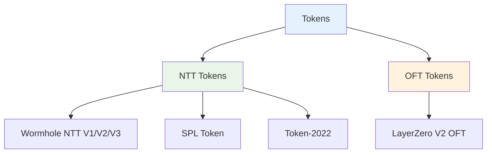
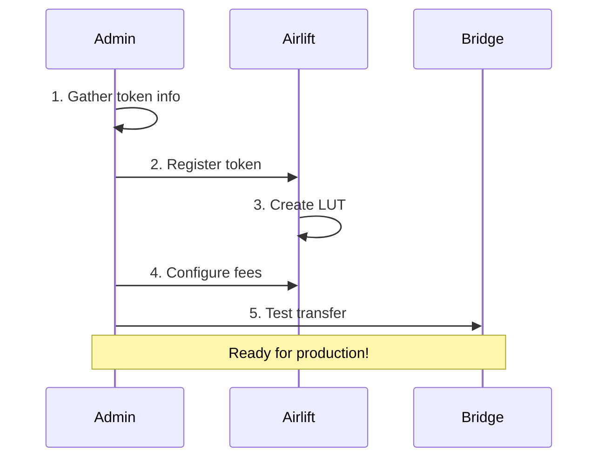

# Token Management Overview

Sol-Airlift supports multiple token types and bridge protocols, providing a unified interface for cross-chain transfers.

## Supported Token Types



## Token Standards

### Wormhole NTT (Native Token Transfer)
- **Purpose**: Secure cross-chain transfers with native token properties
- **Modes**: Burn/Mint or Lock/Release
- **Features**: Rate limiting, governance, automatic dust handling
- **Token Support**: Both SPL Token and Token-2022
- **Setup Guide**: [NTT Token Setup](./ntt-setup)

### LayerZero OFT (Omnichain Fungible Token)
- **Purpose**: Native cross-chain functionality without wrapped tokens
- **Features**: Unified liquidity, composability, gas efficiency
- **Integration**: Works with other LayerZero applications
- **Setup Guide**: [LayerZero OFT Setup](./layerzero-setup)

## Quick Start Process



## Adding Tokens

### 1. Choose Your Token Type
- **NTT**: For Wormhole-enabled tokens → [NTT Setup Guide](./ntt-setup)
- **OFT**: For LayerZero-enabled tokens → [OFT Setup Guide](./layerzero-setup)

### 2. Register and Configure
Each token type has specific requirements and configuration steps. Follow the appropriate guide above.

### 3. Create Address Lookup Tables
LUTs are required to optimize transaction size:
```bash
ts-node scripts/create-lut.ts --token YOUR_TOKEN --type ntt|oft
```

### 4. Set Fee Configuration
Configure fees for your token:
```bash
ts-node scripts/set-token-fee.ts --token YOUR_TOKEN --native-fee 0.001 --token-fee 10 --type bps
```

See [Fee Configuration Guide](./fee-configuration) for detailed options.

## Token Management Tools

### List Tokens
```bash
# List all registered tokens
ts-node scripts/list-tokens.ts

# Filter by type
ts-node scripts/list-tokens.ts --type ntt
ts-node scripts/list-tokens.ts --type oft
```

### Update Configuration
```bash
# Update token settings
ts-node scripts/update-token.ts --token YOUR_TOKEN --config updated-config.json
```

### Monitor Health
```bash
# Check token status
ts-node scripts/token-health.ts --token YOUR_TOKEN

# View statistics
ts-node scripts/token-stats.ts --token YOUR_TOKEN
```

## Supported Tokens

For a complete list of supported tokens with their configurations, see [Supported Tokens](../tokens/supported-tokens).

### Popular Mainnet Tokens
- **USDC** (NTT) - Native cross-chain USDC
- **W** (NTT) - Wormhole token  
- **sUSD** (NTT/Token-2022) - Synthetic USD
- **PENGU** (OFT) - Pudgy Penguins token
- **ATH** (OFT) - Aethir token

## Best Practices

1. **Verify Token Authenticity**
   - Check official documentation
   - Verify contract addresses
   - Confirm with token teams

2. **Test Thoroughly**
   - Always test on devnet first
   - Start with small amounts
   - Monitor all destination chains

3. **Security First**
   - Regular audits of configurations
   - Monitor for unusual activity
   - Keep admin keys secure

## Troubleshooting

For common issues and solutions, see [Common Issues](../troubleshooting/common-issues).

## Next Steps

1. **Add Your First Token**
   - [NTT Setup](./ntt-setup) for Wormhole tokens
   - [OFT Setup](./layerzero-setup) for LayerZero tokens

2. **Configure Fees**
   - [Fee Configuration](./fee-configuration)

3. **Optimize Performance**
   - [Creating LUTs](../lut/creating-luts)

4. **Integrate**
   - [SDK Overview](../sdk/overview)
   - [Integration Examples](../examples/integration) 